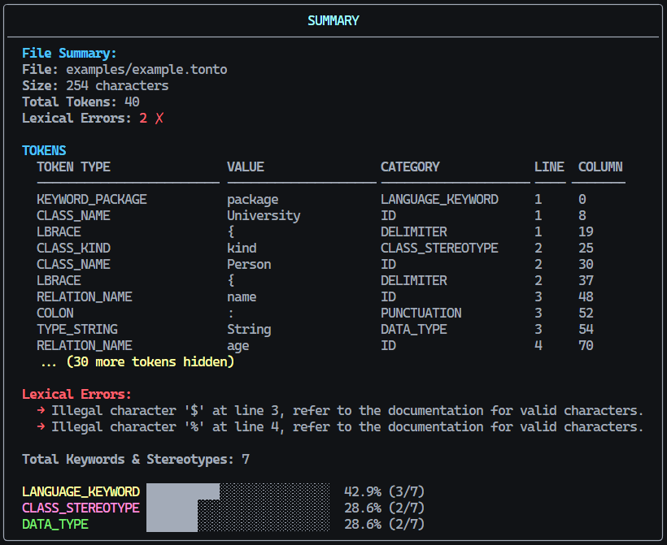

# Disciplina: **Compiladores**
### Curso: Ciência da Computação
### Universidade: UFERSA - Universidade Federal Rural do Semiárido
### Ano: 2025

[](https://ufersa-codehub.github.io/smalltonto/)
[](https://www.python.org/downloads/)
[](LICENSE)


## Sumário
- [Sobre o Projeto](#sobre-o-projeto)
- [Unidade 1: Analisador Léxico](#unidade-1-analisador-léxico)
  - [Problema](#problema)
  - [Implementação](#implementação)
  - [Como usar/executar o trabalho da unidade 1](#como-usarexecutar-o-trabalho-da-unidade-1)	
- [Referências](#referências)

### Exemplo de Saída do Analisador Léxico

O analisador léxico desenvolvido processa arquivos `.tonto` e gera relatórios
detalhados com análise de tokens, detecção de erros e estatísticas:
<div align="center">
    
    <p align="center"><em>
    Exemplo da saída do analisador mostrando tokenização completa, erros léxicos
detectados e estatísticas de distribuição por categoria.
    </em></p>
</div>


## Sobre o Projeto 
No presente repositório estão as implementações avaliativas para a disciplina de Compiladores, separadas por unidade. Cada unidade define a implementação de uma parte de um Compilador de Linguagem de Ontologia Textual (*Textual Ontology Language*, TONTO), limitando-se porém aos analisadores léxico, sintático e semântico, de modo a se adequar ao escopo dessa disciplina.

### Linguagem TONTO - *Textual Ontology Language*
A TONTO (Textual Ontology Language) é uma linguagem textual para especificação de ontologias computacionais — grafos de conhecimento usados na Web Semântica (Web 3.0). Criada para facilitar o desenvolvimento de ontologias por especialistas de diversas áreas, a TONTO permite gerar automaticamente modelos em formatos como OntoUML, JSON e gUFO (OWL). Possui suporte no VSCode, com ferramentas para modularização, orquestração de dependências e conversão entre formatos.

<p align="right">(<a href="#disciplina-compiladores">back to top</a>)</p>

## Unidade 1: Analisador Léxico
### Problema
Projetar um analisador léxico para a linguagem TONTO para reconhecer os elementos da linguagem. Considerando que o autor da ferramenta já disponibiliza um analisador para tal, alguns requisitos mais específicos serão dados neste trabalho de implementação e pesquisa, de forma a permitir que um ontologista crie um documento TONTO com um formato bem definido para cada um dos elementos da linguagem. 

O analisador deve reconhecer os seguintes casos: 
- **Estereótipos de classe:** ``event, situation, process, category, mixin, phaseMixin, roleMixin, historicalRoleMixin, kind, collective, quantity, quality, mode, intrisicMode, extrinsicMode, subkind, phase, role, historicalRole.`` 
- **Estereótipos de relações:** ``material, derivation, comparative, mediation, characterization, externalDependence, subCollectionOf, subQualityOf, componentOf, instantiation, memberOf, termination, participational, participation, historicalDependence, creation, manifestation, bringsAbout, triggers, composition, aggregation, inherence, value, formal, constitution``. 
- **Palavras reservadas:** ``genset, disjoint, complete, general, specifics, where, package, import, functional-complexes.`` 
- **Símbolos especiais:** “{“, “}”, “(“, “)”, “\[“, “\]”, “..”, “<>--” , “--<>”, “*”, “@”, “:”. 
- **Convenção para nomes de classes:** iniciando com letra maiúscula, seguida por qualquer combinação de letras, ou tendo sublinhado como subcadeia própria, sem números. Exemplos: *Person, Child, Church, University, Second_Baptist_Church.*
- **Convenção para nomes de relações:** começando com letra minúscula, seguida por qualquer combinação de letras, ou tendo sublinhado como subcadeia própria, sem números. Exemplos: *has, hasParent, has_parent, isPartOf, is_part_of.* 
- **Convenção para nomes de instâncias:** iniciando com qualquer letra, podendo ter o sublinhado como subcadeia própria e terminando com algum número inteiro. Exemplos: *Planeta1, Planeta2, pizza03, pizza123.* 
- **Tipos de dados nativos:** ``number, string, boolean, date, time, datetime.`` 
- **Novos tipos:** iniciando com letra, sem números, sem sublinhado e terminando com a subcadeia “DataType”. Exemplo: *CPFDataType, PhoneNumberDataType.* 
- **Meta-atributos:** ``ordered, const, derived, subsets, redefines.``
### Requisitos
O trabalho deverá ser elaborado e avaliado de acordo com os seguintes critérios:
- O projeto será parcialmente automatizado com o uso da ferramenta LEX e suas variações: FLEX e PLY. A implementação deverá ser feita em C++ ou Python. 
- Exemplos de teste disponíveis em: https://github.com/patricioalencar/Compiladores_UFERSA
- Os trabalhos deverão estar no GitHub, com documentação apropriada. 
- A saída da análise deverá compreender duas visualizações: 
	- (1) visão analítica de todos os tokens, com indexação de linha e coluna de localização no código-fonte; e 
	- (2) tabela de síntese, contendo quantidades de classes, relações, palavras-chave, indivíduos (instâncias, se houver), palavras reservadas e meta-atributos. 
- Erros deverão ser tratados pela linha onde foram encontrados, com sugestões de tratamento compatíveis com a especificação da linguagem. Não deixar estourar erros sem explicação ou tratamento. 
- A atividade de cada membro do grupo será verificada no GitHub. 
- O vídeo explicativo de 05 (cinco) minutos é obrigatório.

### Implementação
Para fazer uso dos algoritmos implementados, é necessário ter instalado no computador uma versão do Python compatível com a versão 3.13.

Os arquivos necessários ao analisador léxico estão no caminho `apps/core/lexer`, a partir da raiz do projeto. Estes são:
- `lexer/Lexer.py`, onde são definidas regras/convenções para identificação de tokens, baseadas nas diretrizes da linguagem.
- `lexer/TokenType.py`, onde são declarados todos os casos de reconhecimento da linguagem TONTO, a saber, palavras reservadas, estereótipos de classe e relação, tipos de dados, meta-atributos e símbolos especiais (parênteses, chaves, vírgula, etc).
- `lexer/Tokenizer.py`, onde o lexer é construído e suas regras são aplicadas para "tokenizar" um arquivo `.tonto` à escolha do usuário. Aqui também é construída a saída do analisador no terminal.
- `lexer/Utils.py`, onde ocorre a formatação de saída do analisador léxico, com adição de cores e estruturação das seções e informações da tabela de símbolos e indicações de erros.
  
Também, a pasta `apps/core/examples` contém códigos `.tonto` que foram usados para validar a eficácia do algoritmo diante de diferentes entradas. 
  - A pasta `examples/professor` contém códigos de exemplo fornecidos pelo professor da disciplina destinados a auxiliar na testabilidade do analisador. 
  - O arquivo `example.tonto` é um código menor feito para testar mudanças pontuais na análise léxica.

<p align="right">(<a href="#disciplina-compiladores">back to top</a>)</p>

---

### Como usar/executar o trabalho da unidade 1
Para executar a análise léxica, siga os seguintes passos:
1. Clone o repositório para seu computador:
```bash
git clone https://github.com/UFERSA-Codehub/smalltonto.git
```
2. Abra o projeto na sua IDE de preferência na pasta do projeto que surgiu (smalltonto) quando você clonou.
3. Abra o **Terminal** da IDE e navegue até a pasta `core`. (TODO: caminho para Linux).
```bash
cd apps/core
```
4. Ative um ambiente virtual (*virtual environment*, venv) local para execução de scripts em python. Fique atento à [Observação](#observação).
```bash
.\.venv\Scripts\activate
```
Um indicador da execução do ambiente virtual `(venv)`estará visível no início da linha no terminal.

5. Instale as bibliotecas e dependências necessárias ao funcionamento do projeto.
```bash
pip install -r requirements.txt
```
6. Execute o analisador léxico dentro do ambiente virtual python:
```bash
python lexer/tokenizer.py [caminho-do-arquivo] --[flag]
```
Onde:
- `caminho-do-arquivo` refere-se ao caminho relativo do arquivo a ser testado 
- `flag` refere-se a flags de formatação da saída. Atualmente, há apenas uma flag:
	- `--truncate`: limita a quantidade de tokens na tela para 20 entradas. Usada para visualizar mais rapidamente o sumário de análise léxica, evitando rolagens de tela excessivasa.
	- Sem flags: todos os tokens processados no arquivo são mostrados na tabela de símbolos.
#### Observação
É possível que, na etapa de ativação da venv, você encontre um erro relacionado à execução de scripts pelo terminal.  Por padrão desde a versão 7, o Windows bloqueia a execução de scripts dessa maneira, então é necessário desativar essa política de execução:
1. Abra o programa PowerShell em modo de administrador.
2. Modifique a política de execução de scripts de ativação do sistema:
```bash
Set-ExecutionPolicy AllSigned
```
3. O sistema pedirá permissão para confiar no signer do script de ativação da venv.  
```bash
Do you want to run software from this untrusted publisher?
File C:\foo\scripts\activate.ps1 is published by E=jannis@leidel.info,
CN=Jannis Leidel, L=Berlin, S=Berlin, C=DE, Description=581796-Gh7xfJxkxQSIO4E0
and is not trusted on your system. Only run scripts from trusted publishers.
[V] Never run  [D] Do not run  [R] Run once  [A] Always run  [?] Help
(default is "D")
```
4. Selecionando `[A] Always Run`, o certificado será adicionado para os Autores Confiáveis da sua conta de usuário, e será confiado nesse contexto de usuário a partir de agora.

<p align="right">(<a href="#disciplina-compiladores">back to top</a>)</p>

## Referências
1. W3C. (2025). Resource Description Framework – Concepts and Abstract Data Model. Disponível online em: https://www.w3.org/TR/rdf12-concepts/ 
2. W3C. (2012). Web Ontology Language Conformance (Second Edition). Disponível online em: https://www.w3.org/TR/owl2-conformance/ 
3. Guizzardi, G., Fonseca, C. M., Benevides, A. B., Almeida, J. P. A., Porello, D., & Sales, T. P. (2018, September). Endurant types in ontology-driven conceptual modeling: Towards OntoUML 2.0. In International Conference on Conceptual Modeling (pp. 136-150). Cham: Springer International Publishing. 
4. Coutinho, M. L., Almeida, J. P. A., Sales, T. P., & Guizzardi, G. (2024). A Textual Syntax and Toolset for Well-Founded Ontologies. In 14th International Conference on Formal Ontology in Information Systems, FOIS 2024 (pp. 208-222). IOS. 
5. Lenke, M., Tonto: A Textual Syntax for OntoUML – A textual way for conceptual modeling. Available online at: https://matheuslenke.github.io/tonto-docs/
