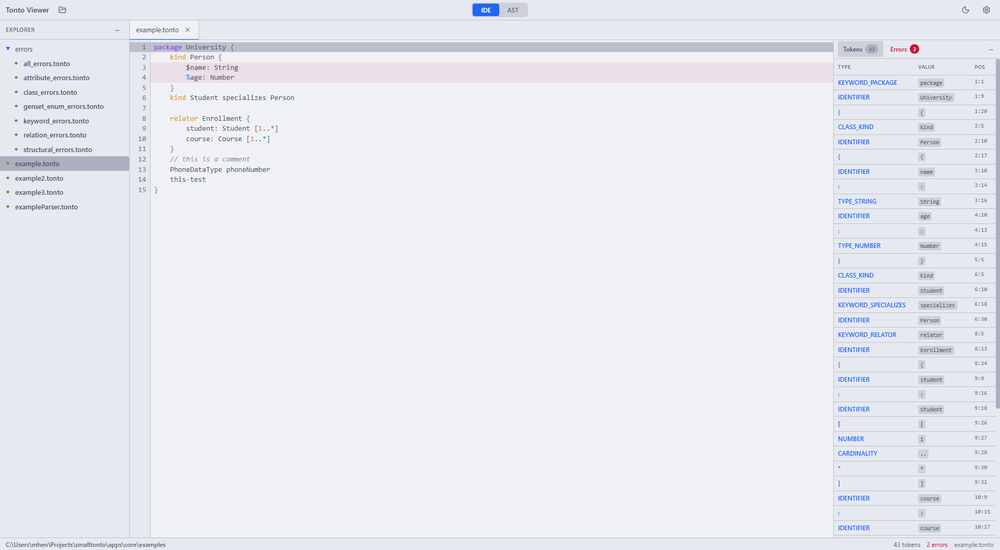
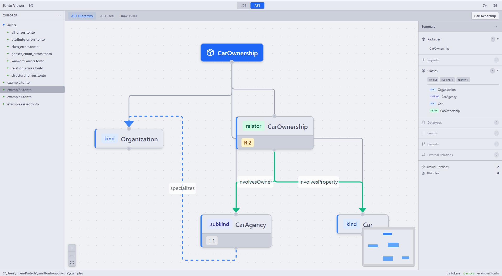
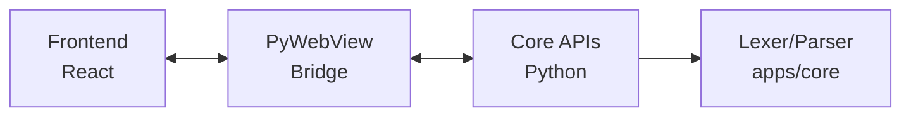

<div align="center">
  <h1>SmallTonto Viewer</h1>
  <p>Aplicação desktop para visualização e análise de código TONTO</p>

  <p>
    <a href="https://www.python.org/downloads/">
      
    </a>
    <a href="https://nodejs.org/">
      
    </a>
    <a href="https://react.dev/">
      
    </a>
  </p>

  
</div>

---

## Sumário

- [Funcionalidades](#funcionalidades)
- [Requisitos](#requisitos)
- [Instalação](#instalação)
  - [Backend (Python)](#1-backend-python)
  - [Frontend (React)](#2-frontend-react)
- [Executando a Aplicação](#executando-a-aplicação)
  - [Modo Desenvolvimento](#modo-desenvolvimento)
  - [Modo Produção](#modo-produção)
- [Desenvolvimento](#desenvolvimento)
  - [Estrutura do Frontend](#estrutura-do-frontend)
  - [Stack Tecnológica](#stack-tecnológica)
  - [Scripts Disponíveis](#scripts-disponíveis)
- [Arquitetura](#arquitetura)
  - [Fluxo de Dados](#fluxo-de-dados)
  - [APIs Expostas](#apis-expostas)
- [Build](#build)

---

## Funcionalidades

- **Editor de código** - Editor com syntax highlighting para arquivos `.tonto`
- **Explorador de arquivos** - Navegação e abertura de arquivos do sistema
- **Visualização de tokens** - Lista detalhada de tokens gerados pelo analisador léxico
- **Visualização da AST** - Árvore sintática abstrata em formato interativo
- **Diagrama OntoUML** - Representação visual do modelo ontológico
- **Detecção de erros** - Erros léxicos e sintáticos em tempo real com recomendações

<div align="center">
  
  <p><em>Visualização da Árvore Sintática Abstrata (AST)</em></p>
</div>

<p align="right">(<a href="#sumário">voltar ao topo</a>)</p>

---

## Requisitos

- **Python** 3.11 ou superior
- **Node.js** 18 ou superior
- **npm** (incluído com Node.js)

---

## Instalação

### 1. Backend (Python)

Primeiro, configure o ambiente Python no diretório `core`:

```bash
cd apps/core
python -m venv .venv

# Windows (PowerShell)
.\.venv\Scripts\activate

# Linux/macOS
source .venv/bin/activate

pip install -r requirements.txt
```

### 2. Frontend (React)

Em seguida, instale as dependências do frontend:

```bash
cd apps/viewer/frontend
npm install
```

<p align="right">(<a href="#sumário">voltar ao topo</a>)</p>

---

## Executando a Aplicação

### Modo Desenvolvimento

O modo desenvolvimento permite hot-reload do frontend para facilitar o desenvolvimento.

**Terminal 1 - Frontend (Vite dev server):**
```bash
cd apps/viewer/frontend
npm run dev
```

**Terminal 2 - Backend (PyWebView):**
```bash
cd apps/viewer
python app.py
```

### Modo Produção

Para executar a aplicação sem o servidor de desenvolvimento:

**1. Build do frontend:**
```bash
cd apps/viewer/frontend
npm run build
```

**2. Executar a aplicação:**
```bash
cd apps/viewer
python app.py
```

<p align="right">(<a href="#sumário">voltar ao topo</a>)</p>

---

## Desenvolvimento

### Estrutura do Frontend

```
frontend/src/
├── components/
│   ├── AstViewer/           # Visualização da AST
│   │   ├── AstTreeView/     # Árvore hierárquica
│   │   ├── DetailPanel/     # Painel de detalhes
│   │   ├── HierarchyDiagram/# Diagrama de hierarquia
│   │   └── OntoUmlDiagram/  # Diagrama OntoUML
│   │
│   ├── Editor/              # Editor de código
│   │   ├── CodeEditor.jsx   # Componente principal do editor
│   │   ├── EditorTabs.jsx   # Abas de arquivos
│   │   ├── TokenList.jsx    # Lista de tokens
│   │   └── ErrorList.jsx    # Lista de erros
│   │
│   ├── FileExplorer/        # Explorador de arquivos
│   │   ├── FileTree.jsx     # Árvore de diretórios
│   │   └── FolderPicker.jsx # Seletor de pasta
│   │
│   ├── Layout/              # Componentes de layout
│   │   ├── Sidebar.jsx      # Barra lateral
│   │   ├── StatusBar.jsx    # Barra de status
│   │   └── Toolbar.jsx      # Barra de ferramentas
│   │
│   ├── Settings/            # Configurações
│   │   └── SettingsModal.jsx
│   │
│   └── AppShell.jsx         # Shell principal da aplicação
│
├── hooks/                   # React hooks customizados
│   ├── useKeyboardShortcuts.js
│   └── useSettings.js
│
├── styles/                  # Estilos e temas
│   └── theme.js
│
├── App.jsx                  # Componente raiz
└── main.jsx                 # Ponto de entrada
```

### Stack Tecnológica

<div align="center">
  <table>
    <thead>
      <tr>
        <th>Camada</th>
        <th>Tecnologia</th>
        <th>Descrição</th>
      </tr>
    </thead>
    <tbody>
      <tr>
        <td><strong>Backend</strong></td>
        <td>Python + PyWebView</td>
        <td>Interface entre Python e a janela web</td>
      </tr>
      <tr>
        <td><strong>Frontend</strong></td>
        <td>React 18</td>
        <td>Biblioteca de UI</td>
      </tr>
      <tr>
        <td><strong>Bundler</strong></td>
        <td>Vite</td>
        <td>Build tool e dev server</td>
      </tr>
      <tr>
        <td><strong>Diagramas</strong></td>
        <td>ReactFlow</td>
        <td>Biblioteca para diagramas interativos</td>
      </tr>
      <tr>
        <td><strong>Layout</strong></td>
        <td>ELK.js</td>
        <td>Auto-layout para grafos</td>
      </tr>
    </tbody>
  </table>
</div>

### Scripts Disponíveis

```bash
# No diretório frontend/
npm run dev      # Inicia servidor de desenvolvimento
npm run build    # Build de produção
npm run lint     # Executa ESLint
npm run preview  # Preview do build de produção
```

<p align="right">(<a href="#sumário">voltar ao topo</a>)</p>

---

## Arquitetura

```
apps/viewer/
├── api/
│   ├── __init__.py
│   ├── file_system.py    # API de sistema de arquivos
│   └── parser_api.py     # API do lexer/parser
│
├── frontend/             # Aplicação React (veja estrutura acima)
│
├── app.py                # Ponto de entrada principal
└── viewer.spec           # Configuração do PyInstaller
```

### Fluxo de Dados



### APIs Expostas

**file_system.py:**
- `list_directory(path)` - Lista arquivos de um diretório
- `read_file(path)` - Lê conteúdo de um arquivo
- `select_folder()` - Abre diálogo para seleção de pasta

**parser_api.py:**
- `tokenize(code)` - Retorna tokens do código
- `parse(code)` - Retorna AST e erros

<p align="right">(<a href="#sumário">voltar ao topo</a>)</p>

---

## Build

Para criar um executável standalone da aplicação:

### 1. Certifique-se de que o frontend está buildado

```bash
cd apps/viewer/frontend
npm run build
```

### 2. Execute o PyInstaller

```bash
cd apps/viewer
pyinstaller viewer.spec --noconfirm
```

O executável será gerado no diretório `dist/`.

<p align="right">(<a href="#sumário">voltar ao topo</a>)</p>

---

<div align="center">
  <p>
    <a href="../../README.md">← Voltar para o README principal</a>
  </p>
</div>
